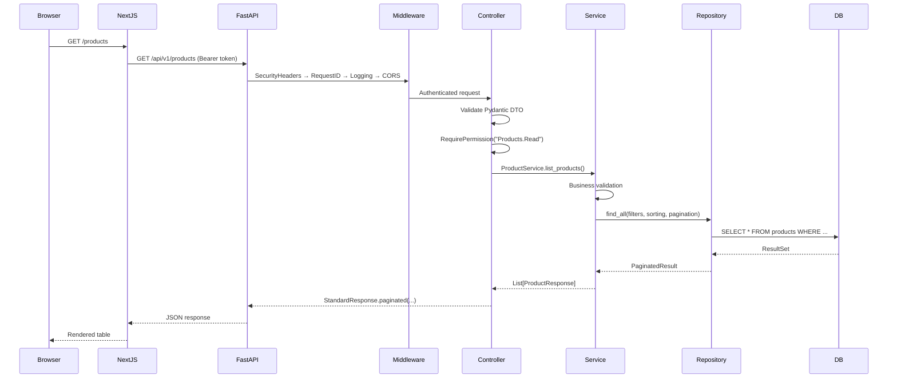
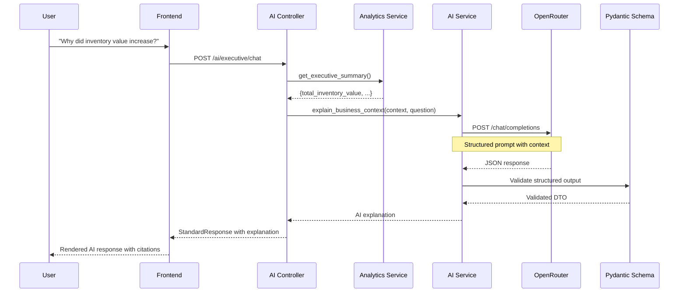

# ProcureFlow AI — Architecture Layer & Flow Diagrams

**Version:** 1.0.0
**Date:** 2026-06-30

---

## Architecture Layers

```
┌─────────────────────────────────────────────────────────────┐
│                    PRESENTATION LAYER                        │
│  ┌───────────────────────────────────────────────────────┐  │
│  │  Next.js 15 App Router (React 19 + TypeScript)        │  │
│  │  ┌──────────┐ ┌──────────┐ ┌──────────┐ ┌──────────┐ │  │
│  │  │   Pages  │ │Components│ │Providers │ │  Hooks   │ │  │
│  │  └──────────┘ └──────────┘ └──────────┘ └──────────┘ │  │
│  └───────────────────────────────────────────────────────┘  │
└─────────────────────────────────────────────────────────────┘
                            │ HTTPS + JWT
┌─────────────────────────────────────────────────────────────┐
│                     CONTROLLER LAYER                         │
│  ┌───────────────────────────────────────────────────────┐  │
│  │  FastAPI Route Handlers (api/)                        │  │
│  │  - Input validation (Pydantic)                        │  │
│  │  - Permission enforcement (RBAC)                      │  │
│  │  - Delegation to services                             │  │
│  │  - StandardResponse formatting                        │  │
│  └───────────────────────────────────────────────────────┘  │
└─────────────────────────────────────────────────────────────┘
                            │
┌─────────────────────────────────────────────────────────────┐
│                      SERVICE LAYER                           │
│  ┌───────────────────────────────────────────────────────┐  │
│  │  Business Logic (services/)                           │  │
│  │  - Deterministic business rules                       │  │
│  │  - Validation (BusinessValidator)                     │  │
│  │  - Transaction coordination (UnitOfWork)              │  │
│  │  - Workflow orchestration                             │  │
│  └───────────────────────────────────────────────────────┘  │
└─────────────────────────────────────────────────────────────┘
                            │
┌─────────────────────────────────────────────────────────────┐
│                    REPOSITORY LAYER                          │
│  ┌───────────────────────────────────────────────────────┐  │
│  │  Data Access (repositories/)                          │  │
│  │  - Generic CRUD (BaseRepository)                      │  │
│  │  - 16 filter operators                                │  │
│  │  - Pagination, sorting                                │  │
│  │  - Never contains business logic                      │  │
│  └───────────────────────────────────────────────────────┘  │
└─────────────────────────────────────────────────────────────┘
                            │
┌─────────────────────────────────────────────────────────────┐
│                     DATABASE LAYER                           │
│  ┌───────────────────────────────────────────────────────┐  │
│  │  Neon PostgreSQL + SQLAlchemy 2 + Alembic             │  │
│  └───────────────────────────────────────────────────────┘  │
└─────────────────────────────────────────────────────────────┘
```

---

## AI Governance Layer

```
┌──────────────────────────────────────────────────────────────┐
│                    AI INTELLIGENCE LAYER                       │
│  ┌────────────────────────────────────────────────────────┐  │
│  │  AI May:                                               │  │
│  │  • Explain business metrics and trends                 │  │
│  │  • Summarize operational data                          │  │
│  │  • Compare suppliers, products, performance            │  │
│  │  • Recommend actions (with citations)                  │  │
│  │  • Classify risks and opportunities                    │  │
│  │  • Generate structured outputs (validated JSON)        │  │
│  └────────────────────────────────────────────────────────┘  │
│                         │                                     │
│                    Tool Runtime                                │
│                         │                                     │
│  ┌──────────────────────▼─────────────────────────────────┐  │
│  │  AI Must NEVER:                                        │  │
│  │  • Calculate inventory, financial values, or KPIs      │  │
│  │  • Approve purchase orders or modify business data     │  │
│  │  • Access repositories or ORM models directly          │  │
│  │  • Execute SQL queries                                 │  │
│  │  • Make autonomous business decisions                  │  │
│  │  • Bypass business services                            │  │
│  └────────────────────────────────────────────────────────┘  │
└──────────────────────────────────────────────────────────────┘
                            │
            (Tools call Services, never DB directly)
                            │
┌──────────────────────────────────────────────────────────────┐
│               DETERMINISTIC BUSINESS LAYER                    │
│  All calculations, validations, approvals, transactions      │
└──────────────────────────────────────────────────────────────┘
```

---

## Dependency Graph

```
main.py
  ├── app.core.config (Settings)
  ├── app.core.logging (structlog)
  ├── app.core.exceptions_handlers
  ├── app.middleware.security (SecurityHeaders)
  ├── app.middleware.request_id
  ├── app.middleware.logging
  └── app.api.router
        ├── app.api.health
        ├── app.api.auth ───► app.services.auth_service ───► models.identity
        ├── app.api.products ─► app.services.product_service ─► models.product
        ├── app.api.inventory ─► app.services.inventory_service ─► models.inventory, models.warehouse
        ├── app.api.procurement ─► app.services.procurement_service ─► models.procurement, models.supplier
        ├── app.api.analytics ─► app.services.analytics_service
        ├── app.api.simulation ─► app.services.simulation_service ─► app.services.inventory_service
        └── app.api.ai_routes ─► app.ai.services.ai_service ─► app.ai.providers.openrouter

All services ──► app.repositories.base (BaseRepository)
All services ──► app.core.exceptions
All schemas ──► app.schemas.common (StandardResponse)
```

---

## Sequence Diagram: Request Flow



---

## Sequence Diagram: AI Flow


