# ProcureFlow AI — Entity-Relationship Diagrams

**Version:** 1.0.0
**Date:** 2026-06-30

---

## Logical ER Diagram

```mermaid
erDiagram
    USERS ||--o{ USER_ROLES : has
    USERS ||--o{ USER_SESSIONS : has
    ROLES ||--o{ USER_ROLES : assigned
    ROLES ||--o{ ROLE_PERMISSIONS : contains
    PERMISSIONS ||--o{ ROLE_PERMISSIONS : granted

    PRODUCTS }o--|| BRANDS : belongs_to
    PRODUCTS }o--|| CATEGORIES : categorized_in
    PRODUCTS }o--|| UNITS : measured_in
    PRODUCTS ||--o{ PRODUCT_IMAGES : has
    PRODUCTS ||--o{ PRODUCT_DOCUMENTS : has
    PRODUCTS ||--o{ PRODUCT_ATTRIBUTES : has
    CATEGORIES ||--o{ CATEGORIES : parent_of

    WAREHOUSES ||--o{ WAREHOUSE_ZONES : contains
    WAREHOUSE_ZONES ||--o{ WAREHOUSE_BINS : contains

    PRODUCTS ||--o{ INVENTORY : tracked_in
    WAREHOUSES ||--o{ INVENTORY : stores
    INVENTORY ||--o{ INVENTORY_TRANSACTIONS : recorded
    INVENTORY ||--o{ STOCK_RESERVATIONS : reserved
    INVENTORY ||--o{ STOCK_ADJUSTMENTS : adjusted
    INVENTORY ||--o{ STOCK_TRANSFER_ITEMS : transferred
    STOCK_TRANSFERS ||--o{ STOCK_TRANSFER_ITEMS : contains
    INVENTORY ||--o{ INVENTORY_SNAPSHOTS : snapshotted
    INVENTORY ||--o{ INVENTORY_THRESHOLDS : threshold

    SUPPLIERS ||--o{ SUPPLIER_CONTACTS : has
    SUPPLIERS ||--o{ SUPPLIER_ADDRESSES : has
    SUPPLIERS ||--o{ SUPPLIER_DOCUMENTS : has
    SUPPLIERS ||--o{ SUPPLIER_PERFORMANCE : tracked

    PURCHASE_REQUESTS }o--|| WAREHOUSES : requested_by
    PURCHASE_ORDERS }o--|| SUPPLIERS : orders_from
    PURCHASE_ORDERS }o--|| WAREHOUSES : delivers_to
    PURCHASE_ORDERS ||--o{ PURCHASE_ORDER_ITEMS : contains
    PURCHASE_ORDERS ||--o{ PURCHASE_ORDER_APPROVALS : approved_by
    PURCHASE_ORDERS ||--o{ GOODS_RECEIVED_NOTES : receives
    PURCHASE_ORDERS ||--o{ PURCHASE_RECEIPTS : receipt
    SUPPLIERS ||--o{ SUPPLIER_QUOTATIONS : provides

    INVOICES }o--|| SUPPLIERS : billed_by
    INVOICES ||--o{ INVOICE_ITEMS : contains
    INVOICES ||--o{ PAYMENTS : paid

    WORKFLOWS ||--o{ WORKFLOW_EXECUTIONS : runs
    WORKFLOW_EXECUTIONS ||--o{ WORKFLOW_HISTORY : logs
    WORKFLOWS ||--o{ WORKFLOW_TRIGGERS : triggered_by
    WORKFLOWS ||--o{ WORKFLOW_ACTIONS : executes

    AI_CONVERSATIONS ||--o{ AI_MESSAGES : contains
    PROMPT_TEMPLATES ||--o{ PROMPT_EXECUTIONS : executed

    USERS ||--o{ NOTIFICATIONS : receives
    NOTIFICATIONS ||--o{ NOTIFICATION_HISTORY : delivered

    FILE_CATEGORIES ||--o{ UPLOADED_FILES : categorizes
    UPLOADED_FILES ||--o{ DOCUMENT_REFERENCES : referenced

    DAILY_METRICS }o--|| WAREHOUSES : for
    KPI_SNAPSHOTS }o--|| WAREHOUSES : for
```



---

## Physical ER Diagram (Key Tables)

```mermaid
erDiagram
    users {
        uuid id PK
        string email UK
        string name
        string hashed_password
        bool is_active
        bool is_locked
        int failed_login_attempts
        timestamp last_login_at
        timestamp created_at
        timestamp updated_at
        bool is_deleted
        timestamp deleted_at
    }

    roles {
        uuid id PK
        string name UK
        string description
        bool is_system
        timestamp created_at
    }

    permissions {
        uuid id PK
        string name UK
        string description
        string group
    }

    products {
        uuid id PK
        string sku UK
        string barcode UK
        string name
        text description
        uuid brand_id FK
        uuid category_id FK
        decimal cost_price
        decimal selling_price
        decimal gst_rate
        string hsn_code
        bool is_active
        int reorder_level
        int safety_stock
    }

    inventory {
        uuid id PK
        uuid product_id FK
        uuid warehouse_id FK
        uuid zone_id FK
        uuid bin_id FK
        string lot_number
        date expiry_date
        int available_quantity
        int reserved_quantity
        int damaged_quantity
        decimal cost_price
    }

    inventory_transactions {
        uuid id PK
        uuid inventory_id FK
        uuid product_id FK
        enum transaction_type
        int before_quantity
        int after_quantity
        int quantity_change
        text reason
        timestamp created_at
    }

    purchase_orders {
        uuid id PK
        string po_number UK
        uuid supplier_id FK
        uuid warehouse_id FK
        enum status
        decimal subtotal
        decimal tax_amount
        decimal total_amount
        date expected_delivery
        timestamp created_at
    }

    purchase_order_items {
        uuid id PK
        uuid purchase_order_id FK
        uuid product_id FK
        int quantity
        int received_quantity
        decimal unit_cost
        decimal line_total
    }

    goods_received_notes {
        uuid id PK
        string grn_number UK
        uuid purchase_order_id FK
        uuid warehouse_id FK
        uuid received_by FK
        date received_date
    }

    suppliers {
        uuid id PK
        string code UK
        string legal_name
        string gst_number UK
        string email
        string country
        float rating
        bool is_active
    }

    supplier_performance {
        uuid id PK
        uuid supplier_id FK UK
        float avg_lead_time_days
        int late_deliveries
        int rejected_goods
        float quality_rating
        float delivery_rating
        float overall_score
        float on_time_delivery_pct
    }

    warehouses {
        uuid id PK
        string code UK
        string name
        string city
        string country
        string warehouse_type
        bool is_active
    }

    workflow {
        uuid id PK
        string name
        string description
        enum status
        json trigger_config
        json flow_definition
        int version
    }

    ai_conversations {
        uuid id PK
        uuid user_id FK
        string title
        string thread_type
    }

    ai_messages {
        uuid id PK
        uuid conversation_id FK
        string role
        text content
        json structured_output
        string model
        int prompt_tokens
        int completion_tokens
        float estimated_cost
        int latency_ms
    }
```

---

## Bounded Contexts

| # | Context | Tables | Purpose |
|---|---------|--------|---------|
| 1 | Identity | users, roles, permissions, user_roles, role_permissions, user_sessions | Auth & RBAC |
| 2 | Product Catalog | products, categories, brands, units, product_images, product_documents, product_attributes | Master data |
| 3 | Inventory | inventory, inventory_transactions, stock_reservations, stock_adjustments, stock_transfers, stock_transfer_items, inventory_snapshots, inventory_thresholds | Stock management |
| 4 | Warehouse | warehouses, warehouse_zones, warehouse_bins | Physical storage |
| 5 | Supplier | suppliers, supplier_contacts, supplier_addresses, supplier_documents, supplier_performance | Vendor management |
| 6 | Procurement | purchase_requests, purchase_orders, purchase_order_items, purchase_order_approvals, goods_received_notes, purchase_receipts, supplier_quotations | Purchasing |
| 7 | Finance | invoices, invoice_items, payments, payment_terms, tax_configurations | Financial records |
| 8 | AI | ai_conversations, ai_messages, prompt_templates, prompt_executions, model_configurations | AI interactions |
| 9 | Automation | workflows, workflow_executions, workflow_history, workflow_triggers, workflow_actions | Business automation |
| 10 | Notifications | notifications, notification_templates, notification_history | User alerts |
| 11 | Audit | audit_logs, change_history | Immutable audit trail |
| 12 | File Storage | uploaded_files, file_categories, document_references | Document management |
| 13 | Dashboard | daily_metrics, kpi_snapshots | Pre-aggregated analytics |

**Total: 13 bounded contexts, 60+ tables**
